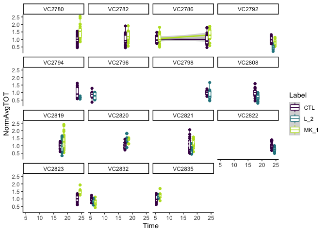

Data independence - Lauren
================
Mike O’Donnell
4/3/2020

  - [Analysis of Lauren’s grouped
    data:](#analysis-of-laurens-grouped-data)
      - [Initial plots:](#initial-plots)
      - [Grouped data visualization:](#grouped-data-visualization)
      - [Anova vs. Mixed-models:](#anova-vs.-mixed-models)

<!-- output: -->

<!--   html_document: -->

<!--     keep_md: true -->

<!--     df_print: paged -->

<details>

<summary>Lauren’s synapse labeling</summary>

<p>

# Analysis of Lauren’s grouped data:

## Initial plots:

First reading in the data and having a look at data types and columns

``` r
SSTRDrugs <- read_csv("data/merckTIME.csv") 
glimpse(SSTRDrugs)
#> Observations: 566
#> Variables: 17
#> $ Image.Name        <chr> "Red", "Red", "Red", "Red", "Red", "Red", "Red…
#> $ Hour              <time>       NA,       NA, 00:00:00, 01:00:00, 05:00…
#> $ Minute            <time>       NA, 21:00:00,       NA,       NA,      …
#> $ Sec               <dbl> 892, 227, 233, 744, 980, 328, 411, 507, 249, 6…
#> $ Summary.Statistic <chr> "Average", "Average", "Average", "Average", "A…
#> $ Area              <dbl> 0.08647458, 0.09638673, 0.09748974, 0.09193923…
#> $ Average.intensity <dbl> 14519.72, 15771.13, 19273.54, 18991.05, 16789.…
#> $ Total.intensity   <dbl> 182299.28, 219680.88, 293729.12, 252930.91, 28…
#> $ Image             <chr> "Copy of Image 29_Maximum intensity projection…
#> $ Overlay           <chr> "GRB_R", "GRB_R", "GRB_R", "GRB_R", "GRB_R", "…
#> $ Treatment         <chr> "CTL", "CTL", "CTL", "CTL", "CTL", "CTL", "CTL…
#> $ NormAvgAVG        <dbl> 0.9570927, 1.0395811, 1.2704491, 1.2518277, 1.…
#> $ NormAvgTOT        <dbl> 0.9493243, 1.1439891, 1.5295957, 1.3171388, 1.…
#> $ Dissociation      <chr> "VC2780", "VC2780", "VC2780", "VC2780", "VC278…
#> $ SLIDE             <chr> "VC2780_S1", "VC2780_S1", "VC2780_S1", "VC2780…
#> $ Time              <chr> "24H", "24H", "24H", "24H", "24H", "24H", "24H…
#> $ Label             <chr> "CTL", "CTL", "CTL", "CTL", "CTL", "CTL", "CTL…
```

Let’s grab the last 5 rows since it looks like those have all of the
necessary information used for analysis. Let’s make `Time` a numeric
column in the process. Then plot the data without considering grouping.

``` r
SSTRDrugs %<>% select(NormAvgTOT, Dissociation, SLIDE, Time, Label) %>%
  separate(Time, into = "Time", sep = "H") %>%
  mutate(Time = as.numeric(Time))

SSTRDrugs %>%
  ggplot(aes(x = Time, y = NormAvgTOT)) +
  geom_smooth(method = "lm", aes(group = Label, colour = Label)) +
  geom_point(aes(group = Label, colour = Label), position = position_dodge(width = 2)) +
  geom_boxplot(aes(group = interaction(Time,Label), colour = Label),  width = 2) +
  scale_colour_viridis_d(end = .9)
```


Looks like the L\_2 group goes down and MK\_1 goes up. Now lets look at
the experiments by dissociation.

``` r
SSTRDrugs %>%
  ggplot(aes(x = Time, y = NormAvgTOT)) +
  geom_smooth(method = "lm", aes(group = Label, colour = Label)) +
  geom_point(aes(group = Label, colour = Label), position = position_dodge(width = 2)) +
  geom_boxplot(aes(group = interaction(Time,Label), colour = Label),  width = 2) +
  scale_colour_viridis_d(end = .9) +
  facet_wrap(~Dissociation)
```



Looks complicated, let’s look at the difference between `CTL` and each
drug treatment at each time point by dissociation.

</p>

</details>

## Grouped data visualization:

``` r
Summary_dissoc <- SSTRDrugs %>%
  group_by(Dissociation, Time, Label) %>%
  summarise(median = median(NormAvgTOT))

Summary_dissoc %>% 
  ggplot(aes(x = Time, y = median)) +
  geom_smooth(method = "lm", aes(group = Label, colour = Label), lty = 2, alpha = 0.25) +
  geom_smooth(data = SSTRDrugs, method = "lm", 
              aes(y = NormAvgTOT, group = Label, colour = Label), fill = "blue") +
  geom_boxplot(aes(group = interaction(Time,Label), colour = Label),  width = 2) +
  geom_point(aes(group = Label, colour = Label), position = position_dodge(width = 2)) +
  scale_colour_viridis_d(end = .9)
```

 This
time shoing the effect by `Dissociation`, which has the same slopes,
probably because the data are already normalized by `Dissociation`. The
Standard error for the original data are in blue with solid lines, the
new based on summaries by Dissociation are in grey with dashed lines.
Standard errors are much wider because in this highly conservative way
to look at the data, the n is much smaller. The real variability is
probably somewhere in between these. So let’s look by `slide` on which
the cells were stained, which is another level of grouping.

``` r
Summary_slide <- SSTRDrugs %>%
  group_by(SLIDE, Time, Label) %>%
  summarise(median = median(NormAvgTOT))

Summary_slide %>% 
  ggplot(aes(x = Time, y = median)) +
  geom_smooth(method = "lm", aes(group = Label, colour = Label), lty = 2, alpha = 0.25) +
  geom_smooth(data = SSTRDrugs, method = "lm", 
              aes(y = NormAvgTOT, group = Label, colour = Label), fill = "blue") +
  geom_boxplot(aes(group = interaction(Time,Label), colour = Label),  width = 2) +
  geom_point(aes(group = Label, colour = Label), position = position_dodge(width = 2)) +
  scale_colour_viridis_d(end = .9)
```

 This
is comforting because even when grouped by slide on which the cells were
stained, we have the same overall trend. This likely is a bit closer to
the effective n for the experiment, since cells on same `SLIDE` and
`Dissocation` are not truly independent. The linear approximation does
an okay job at capturing the time component. Let’s compare the effects
of modeling these grouping factors.

## Anova vs. Mixed-models:

``` r
#simple ANOVA
lm.anova <- SSTRDrugs %>%
  lm(data = ., formula = NormAvgTOT ~ Time * Label)

lm.grouped <- SSTRDrugs %>%
  lmerTest::lmer(data = ., formula = NormAvgTOT ~ Time *  Label + (1 | Dissociation) + (1 | SLIDE))

lm.anova %>%
  summary()
#> 
#> Call:
#> lm(formula = NormAvgTOT ~ Time * Label, data = .)
#> 
#> Residuals:
#>      Min       1Q   Median       3Q      Max 
#> -0.79948 -0.22363 -0.03434  0.20754  1.20796 
#> 
#> Coefficients:
#>                  Estimate Std. Error t value Pr(>|t|)    
#> (Intercept)     0.9784568  0.0618946  15.808  < 2e-16 ***
#> Time            0.0009813  0.0031558   0.311  0.75596    
#> LabelL_2        0.0977180  0.1133331   0.862  0.38894    
#> LabelMK_1      -0.0542652  0.0966145  -0.562  0.57457    
#> Time:LabelL_2  -0.0138019  0.0059490  -2.320  0.02070 *  
#> Time:LabelMK_1  0.0161723  0.0050069   3.230  0.00131 ** 
#> ---
#> Signif. codes:  0 '***' 0.001 '**' 0.01 '*' 0.05 '.' 0.1 ' ' 1
#> 
#> Residual standard error: 0.3315 on 560 degrees of freedom
#> Multiple R-squared:  0.195,  Adjusted R-squared:  0.1878 
#> F-statistic: 27.13 on 5 and 560 DF,  p-value: < 2.2e-16

lm.grouped %>%
  summary()
#> Linear mixed model fit by REML. t-tests use Satterthwaite's method [
#> lmerModLmerTest]
#> Formula: NormAvgTOT ~ Time * Label + (1 | Dissociation) + (1 | SLIDE)
#>    Data: .
#> 
#> REML criterion at convergence: 311.8
#> 
#> Scaled residuals: 
#>     Min      1Q  Median      3Q     Max 
#> -2.6040 -0.5771 -0.0769  0.5195  3.8950 
#> 
#> Random effects:
#>  Groups       Name        Variance Std.Dev.
#>  SLIDE        (Intercept) 0.029225 0.17095 
#>  Dissociation (Intercept) 0.008286 0.09103 
#>  Residual                 0.077145 0.27775 
#> Number of obs: 566, groups:  SLIDE, 103; Dissociation, 15
#> 
#> Fixed effects:
#>                  Estimate Std. Error         df t value Pr(>|t|)    
#> (Intercept)      0.952729   0.108946  64.552368   8.745 1.47e-12 ***
#> Time             0.001750   0.005481  69.417714   0.319    0.750    
#> LabelL_2         0.049658   0.164339 104.994427   0.302    0.763    
#> LabelMK_1       -0.030304   0.144423  96.021929  -0.210    0.834    
#> Time:LabelL_2   -0.010227   0.008747 102.327339  -1.169    0.245    
#> Time:LabelMK_1   0.015027   0.007534  94.229879   1.995    0.049 *  
#> ---
#> Signif. codes:  0 '***' 0.001 '**' 0.01 '*' 0.05 '.' 0.1 ' ' 1
#> 
#> Correlation of Fixed Effects:
#>             (Intr) Time   LblL_2 LbMK_1 T:LL_2
#> Time        -0.932                            
#> LabelL_2    -0.492  0.464                     
#> LabelMK_1   -0.602  0.578  0.452              
#> Time:LblL_2  0.439 -0.467 -0.947 -0.409       
#> Tim:LblMK_1  0.557 -0.595 -0.409 -0.934  0.404

lm.anova %>%
  #emmeans::emmeans("Label", by = "Time") %>%
  emmeans::emmeans(pairwise ~ Label)
#> $emmeans
#>  Label emmean     SE  df lower.CL upper.CL
#>  CTL    0.996 0.0208 560    0.955    1.037
#>  L_2    0.843 0.0278 560    0.788    0.898
#>  MK_1   1.236 0.0254 560    1.186    1.286
#> 
#> Confidence level used: 0.95 
#> 
#> $contrasts
#>  contrast   estimate     SE  df t.ratio p.value
#>  CTL - L_2     0.153 0.0348 560   4.412 <.0001 
#>  CTL - MK_1   -0.240 0.0329 560  -7.299 <.0001 
#>  L_2 - MK_1   -0.393 0.0377 560 -10.429 <.0001 
#> 
#> P value adjustment: tukey method for comparing a family of 3 estimates

lm.grouped %>%
  #emmeans::emmeans("Label", by = "Time") %>%
  emmeans::emmeans(pairwise ~ Label)
#> $emmeans
#>  Label emmean     SE   df lower.CL upper.CL
#>  CTL    0.985 0.0395 26.8    0.904    1.066
#>  L_2    0.848 0.0488 44.6    0.750    0.946
#>  MK_1   1.228 0.0483 40.0    1.130    1.325
#> 
#> Degrees-of-freedom method: satterthwaite 
#> Confidence level used: 0.95 
#> 
#> $contrasts
#>  contrast   estimate     SE   df t.ratio p.value
#>  CTL - L_2     0.136 0.0531 93.2  2.568  0.0314 
#>  CTL - MK_1   -0.243 0.0517 87.8 -4.703  <.0001 
#>  L_2 - MK_1   -0.379 0.0601 99.3 -6.314  <.0001 
#> 
#> P value adjustment: tukey method for comparing a family of 3 estimates
```

What if we consider all of the time points to be categorical?

``` r
############### for categorical 'Time' #######

lm.anova.cat <- SSTRDrugs %>%
  lm(data = ., formula = NormAvgTOT ~ factor(Time) * Label)

anova.cat.emm <- lm.anova.cat %>%
  emmeans::emmeans(pairwise ~ Label | factor(Time))

anova.cat.emm$contrasts %>% rbind(adjust = "bonf")
#>  Time contrast   estimate     SE  df t.ratio p.value
#>  6    CTL - L_2    0.0414 0.0882 557  0.470  1.0000 
#>  6    CTL - MK_1  -0.0382 0.0743 557 -0.514  1.0000 
#>  6    L_2 - MK_1  -0.0796 0.0934 557 -0.852  1.0000 
#>  18   CTL - L_2    0.1116 0.0506 557  2.206  0.2498 
#>  18   CTL - MK_1  -0.2432 0.0528 557 -4.606  <.0001 
#>  18   L_2 - MK_1  -0.3548 0.0539 557 -6.581  <.0001 
#>  24   CTL - L_2    0.2903 0.0608 557  4.778  <.0001 
#>  24   CTL - MK_1  -0.3286 0.0511 557 -6.433  <.0001 
#>  24   L_2 - MK_1  -0.6189 0.0664 557 -9.322  <.0001 
#> 
#> P value adjustment: bonferroni method for 9 tests


lm.grouped.cat <- SSTRDrugs %>%
  lmerTest::lmer(data = ., formula = NormAvgTOT ~ factor(Time) * Label + (1 | Dissociation) + (1 | SLIDE))

grouped.cat.emm <- lm.grouped.cat %>%
  emmeans::emmeans(pairwise ~ Label | factor(Time))

# these are approx p-values based
grouped.cat.emm$contrasts %>% rbind(adjust = "bonf") %>% kableExtra::kable()
```

<table>

<thead>

<tr>

<th style="text-align:left;">

Time

</th>

<th style="text-align:left;">

contrast

</th>

<th style="text-align:right;">

estimate

</th>

<th style="text-align:right;">

SE

</th>

<th style="text-align:right;">

df

</th>

<th style="text-align:right;">

t.ratio

</th>

<th style="text-align:right;">

p.value

</th>

</tr>

</thead>

<tbody>

<tr>

<td style="text-align:left;">

6

</td>

<td style="text-align:left;">

CTL - L\_2

</td>

<td style="text-align:right;">

0.0523626

</td>

<td style="text-align:right;">

0.1276106

</td>

<td style="text-align:right;">

106.94288

</td>

<td style="text-align:right;">

0.4103309

</td>

<td style="text-align:right;">

1.0000000

</td>

</tr>

<tr>

<td style="text-align:left;">

6

</td>

<td style="text-align:left;">

CTL - MK\_1

</td>

<td style="text-align:right;">

\-0.0608716

</td>

<td style="text-align:right;">

0.1117668

</td>

<td style="text-align:right;">

94.56536

</td>

<td style="text-align:right;">

\-0.5446298

</td>

<td style="text-align:right;">

1.0000000

</td>

</tr>

<tr>

<td style="text-align:left;">

6

</td>

<td style="text-align:left;">

L\_2 - MK\_1

</td>

<td style="text-align:right;">

\-0.1132341

</td>

<td style="text-align:right;">

0.1230467

</td>

<td style="text-align:right;">

230.61436

</td>

<td style="text-align:right;">

\-0.9202532

</td>

<td style="text-align:right;">

1.0000000

</td>

</tr>

<tr>

<td style="text-align:left;">

18

</td>

<td style="text-align:left;">

CTL - L\_2

</td>

<td style="text-align:right;">

0.0980911

</td>

<td style="text-align:right;">

0.0754872

</td>

<td style="text-align:right;">

89.04039

</td>

<td style="text-align:right;">

1.2994400

</td>

<td style="text-align:right;">

1.0000000

</td>

</tr>

<tr>

<td style="text-align:left;">

18

</td>

<td style="text-align:left;">

CTL - MK\_1

</td>

<td style="text-align:right;">

\-0.2299994

</td>

<td style="text-align:right;">

0.0861084

</td>

<td style="text-align:right;">

80.12418

</td>

<td style="text-align:right;">

\-2.6710434

</td>

<td style="text-align:right;">

0.0823965

</td>

</tr>

<tr>

<td style="text-align:left;">

18

</td>

<td style="text-align:left;">

L\_2 - MK\_1

</td>

<td style="text-align:right;">

\-0.3280904

</td>

<td style="text-align:right;">

0.0876082

</td>

<td style="text-align:right;">

82.16885

</td>

<td style="text-align:right;">

\-3.7449755

</td>

<td style="text-align:right;">

0.0030030

</td>

</tr>

<tr>

<td style="text-align:left;">

24

</td>

<td style="text-align:left;">

CTL - L\_2

</td>

<td style="text-align:right;">

0.2506334

</td>

<td style="text-align:right;">

0.0978356

</td>

<td style="text-align:right;">

86.48226

</td>

<td style="text-align:right;">

2.5617819

</td>

<td style="text-align:right;">

0.1093161

</td>

</tr>

<tr>

<td style="text-align:left;">

24

</td>

<td style="text-align:left;">

CTL - MK\_1

</td>

<td style="text-align:right;">

\-0.3399407

</td>

<td style="text-align:right;">

0.0809441

</td>

<td style="text-align:right;">

87.10730

</td>

<td style="text-align:right;">

\-4.1996988

</td>

<td style="text-align:right;">

0.0005789

</td>

</tr>

<tr>

<td style="text-align:left;">

24

</td>

<td style="text-align:left;">

L\_2 - MK\_1

</td>

<td style="text-align:right;">

\-0.5905741

</td>

<td style="text-align:right;">

0.1125543

</td>

<td style="text-align:right;">

87.62977

</td>

<td style="text-align:right;">

\-5.2470156

</td>

<td style="text-align:right;">

0.0000096

</td>

</tr>

</tbody>

</table>

In reality the best approach to estimate uncertainty in mixed-effects
models is using bootstapping.

<details>

<summary>CODE</summary>

<p>

``` r
mySumm <- function(.) {
  predict(., newdata=expand_grid(Label = c("CTL", "L_2", "MK_1"), Time = 6:24), re.form=NA)
}

PI.boot1.time <- system.time(
  boot1 <- lme4::bootMer(lm.grouped, mySumm, nsim=250, use.u=FALSE, type="parametric")
)

####Collapse bootstrap into median, 95% PI (from https://cran.r-project.org/web/packages/merTools/vignettes/Using_predictInterval.html)
sumBoot <- function(merBoot) {
  return(
    data.frame(fit = apply(merBoot$t, 2, function(x) as.numeric(quantile(x, probs=.5, na.rm=TRUE))),lwr = apply(merBoot$t, 2, function(x) as.numeric(quantile(x, probs=.025, na.rm=TRUE))),upr = apply(merBoot$t, 2, function(x) as.numeric(quantile(x, probs=.975, na.rm=TRUE)))
    )
  )
}


PI.boot1 <- sumBoot(boot1)
Boot.intervals <- cbind(PI.boot1, expand_grid(Label = c("CTL", "L_2", "MK_1"), Time = 6:24))
```

``` r
#compare bootstrap CIs to lm (anova) CIs
SSTRDrugs %>%
  ggplot(aes(x = Time, y = NormAvgTOT)) +
  geom_ribbon(data = Boot.intervals, 
              aes(y = fit, ymin = lwr, ymax = upr, group = Label), 
              alpha = 0.2, label = "bootstrap intervals") +
  geom_smooth(method = "lm", aes(group = Label, colour = Label),fill = "blue", lty = 2) +
  geom_line(data = Boot.intervals, aes(y = fit, group = Label, colour = Label)) +
  # geom_point(aes(group = Label, colour = Label), position = position_dodge(width = 2)) +
  geom_boxplot(aes(group = interaction(Time,Label), colour = Label),  width = 2) +

  scale_colour_viridis_d(end = .9)
#> Warning: Ignoring unknown parameters: label
#> Warning: Ignoring unknown aesthetics: y
```


The mixed-model captures more of the uncertainty, but still shows we can
be confident of an upward effect of the MK\_1 treatment. Less convincing
is the downward effect of L\_2, with the caveat that this is modeled as
a linear effect, which might not capture the time-dependent effects in
culture.

</p>

</details>
