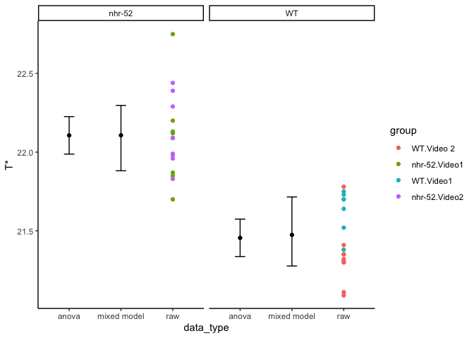

Data independence
================
Mike O’Donnell
4/3/2020

  - [Analysis of Nathan’s grouped
    data:](#analysis-of-nathans-grouped-data)

<!-- output: -->

<!--   html_document: -->

<!--     keep_md: true -->

<!--     df_print: paged -->

<details>

<summary>CODE</summary>

<p>

# Analysis of Nathan’s grouped data:

``` r

#read csv file in:
Tstar <- readr::read_csv("data/WTvsNHR52_Tstar.csv") %>% mutate(group = interaction(genotype, video)) 
Tstar %>%
  ggplot(aes(x = genotype, y = `T*`)) + geom_point(aes(colour = group))
```


``` r


Tstar %>% lm(data = ., `T*` ~ group) %>% 
  emmeans::emmeans("group") %>% 
  emmeans::contrast(method = "pairwise")
#>  contrast                      estimate    SE df t.ratio p.value
#>  WT.Video 2 - nhr-52.Video1     -0.7613 0.102 30 -7.440  <.0001 
#>  WT.Video 2 - WT.Video1         -0.2994 0.110 30 -2.728  0.0490 
#>  WT.Video 2 - nhr-52.Video2     -0.7893 0.106 30 -7.471  <.0001 
#>  nhr-52.Video1 - WT.Video1       0.4619 0.112 30  4.116  0.0015 
#>  nhr-52.Video1 - nhr-52.Video2  -0.0279 0.108 30 -0.258  0.9939 
#>  WT.Video1 - nhr-52.Video2      -0.4898 0.115 30 -4.250  0.0010 
#> 
#> P value adjustment: tukey method for comparing a family of 4 estimates

lm.anova <- Tstar %>% lm(data = ., 0 +`T*` ~ genotype) 
lm.anova %>% emmeans::emmeans("genotype") %>% 
  emmeans::contrast(method = "pairwise")
#>  contrast    estimate     SE df t.ratio p.value
#>  nhr-52 - WT    0.651 0.0827 32 7.874   <.0001

lm.group <- Tstar %>% lme4::lmer(data = ., `T*` ~ 0 + genotype + (1|group)) 
lm.group %>% emmeans::emmeans("genotype") %>% 
  emmeans::contrast(method = "pairwise")
#>  contrast    estimate   SE  df z.ratio p.value
#>  nhr-52 - WT    0.632 0.15 Inf 4.224   <.0001
  
predict.anova <- predict(lm.anova, 
                         newdata = tibble(genotype = c("nhr-52", "WT")), 
                         interval = "confidence")

confint.group <- confint(lm.group, method = "boot")
predict.group <- tibble(fit = predict(lm.group, 
                         newdata = tibble(genotype = c("nhr-52", "WT")),
                         re.form = NA))

intervals <- tibble(
  genotype = rep(c("nhr-52", "WT"), 2),
  data_type = rep(c("anova", "mixed model"), each = 2),
  `T*` = c(predict.anova[,'fit'], predict.group[[1]]),
  lwr  = c(predict.anova[,'lwr'], confint.group[3:4,1]),
  upr  = c(predict.anova[,'upr'], confint.group[3:4,2])
)

Tstar %>% mutate(data_type = "raw") %>%
  ggplot(aes(x = data_type, y = `T*`)) +
  geom_point(aes(colour = group)) +
  geom_point(data = intervals) +
  geom_errorbar(data = intervals, aes(ymin = lwr, ymax = upr), width = 0.2) +
  facet_grid(~genotype)
```



</p>

</details>
