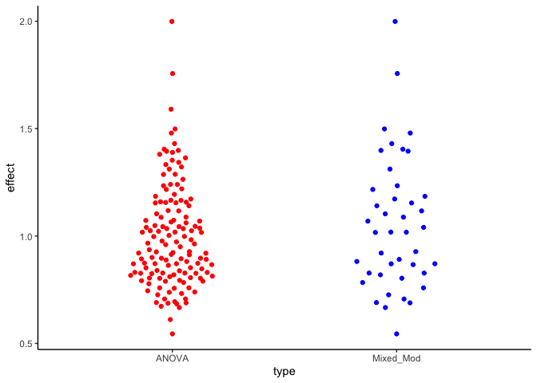

# Basic comparison - 2 groups with independent data:

In this example, we'll simulate the effect of ignoring group-wise correlation when using statistical tests. 

First, using data in which the observations within groups have no correlation 


```r
set.seed(4372)
nObs <- 15
ngroups <- 3
  
  simple_data <- function(...) {tibble(
  condition = rep(c("control", "test"), each = nObs),
  response = c(rnorm(n = nObs, mean = 5, sd = 1),
               rnorm(n = nObs, mean = 5, sd = 1)),
  group = rep(factor(1:6), each = nObs/ngroups)
  )}

Data_noRE <- simple_data()

# get p-value from lm for these:


ggplot(Data_noRE, aes(x = condition, y = response)) +
  geom_point(aes(colour = group))
```


```r

simData_noRE <- purrr::rerun(1000,
  simple_data()) %>%
  bind_rows(., .id = "dataset") %>%
  group_by(dataset) %>% 
  nest() %>%
  mutate(
    linmod = purrr::map(data, ~ lm(response ~ condition, data= .x)),
    mixedmod = purrr::map(data, ~ lmerTest::lmer(response ~ condition + (1|group), data= .x)))

# add tidy columns for p.values:
simData_noRE %<>%
  mutate(lm.p = map(linmod, broom::tidy),
         mm.p = map(mixedmod, broom.mixed::tidy))

# now unnest to select and rename just the p.value
simData_noRE %<>% 
  unnest(lm.p) %>%
  filter(term != "(Intercept)") %>%
  rename(p.val.lm = p.value) %>%
  select(1:4, p.val.lm, mm.p) %>%
  unnest(mm.p) %>%
  filter(term == "conditiontest") %>%
  rename(p.val.mm = p.value) %>%
  select(1:4, p.val.lm, p.val.mm)
  

# get the proportion of p < 0.05
simData_noRE %>%
  ungroup() %>% 
  summarize(typeI.lm = sum(p.val.lm < 0.05)/nrow(.), 
            typeI.mm = sum(p.val.mm < 0.05)/nrow(.)) %>%
  kableExtra::kable()
```

<table>
 <thead>
  <tr>
   <th style="text-align:right;"> typeI.lm </th>
   <th style="text-align:right;"> typeI.mm </th>
  </tr>
 </thead>
<tbody>
  <tr>
   <td style="text-align:right;"> 0.047 </td>
   <td style="text-align:right;"> 0.025 </td>
  </tr>
</tbody>
</table>

So under conditions in which there is no correlation between groups, ie the groups are just imaginary/abritrary grouping, both anova and mixed models have false positive rate of ~0.05 or lower. 

### What if groups are correlated?

In this case, we'll add an rnadom error term, which is a value drawn from a normal distribution to represent the group effect. In each case, the values within a group are random, but each value within a group is multiplied by the random factor (centered at 1). You'll see it's not so obvious to pick out correlated data when looking at them, but see at the bottom what the effect of ignoring this is on typeI error rate. 


```r
nObs <- 15
ngroups <- 3 # number of groups per condition:

  correlated_data <- function(SD = 0.1) {
    # adding a random effect term, which is just a change in the intercept for each group, taken from a normal distribution
    RE <- rnorm(n = ngroups*2, mean = 1, sd = SD)
    tibble(
      condition = rep(c("control", "test"), each = nObs),
      response = purrr::map(RE, ~ .x * rnorm(n = nObs/ngroups, mean = 5, sd = 1)) %>% unlist(),
      group = rep(factor(1:6), each = nObs/ngroups)
  )}

Data_RE <- correlated_data()

ggplot(Data_RE, aes(x = condition, y = response)) +
  geom_point(aes(colour = group))
```


```r

# get p-value from lm for these:


simData_RE <- purrr::rerun(1000,
  correlated_data()) %>%
  bind_rows(., .id = "dataset") %>%
  group_by(dataset) %>% 
  nest() %>%
  mutate(
    linmod = purrr::map(data, ~ lm(response ~ condition, data= .x)),
    mixedmod = purrr::map(data, ~ lmerTest::lmer(response ~ condition + (1|group), data= .x)))

# add tidy columns for p.values:
simData_RE %<>%
  mutate(lm.p = map(linmod, broom::tidy),
         mm.p = map(mixedmod, broom.mixed::tidy))

# now unnest to select and rename just the p.value
simData_RE %<>% 
  unnest(lm.p) %>%
  filter(term != "(Intercept)") %>%
  rename(p.val.lm = p.value) %>%
  select(1:4, p.val.lm, mm.p) %>%
  unnest(mm.p) %>%
  filter(term == "conditiontest") %>%
  rename(p.val.mm = p.value) %>%
  select(1:4, p.val.lm, p.val.mm)
  

# get the proportion of p < 0.05
simData_RE %>%
  ungroup() %>% 
  summarize(typeI.lm = sum(p.val.lm < 0.05)/nrow(.), 
            typeI.mm = sum(p.val.mm < 0.05)/nrow(.)) %>%
  kableExtra::kable()
```

<table>
 <thead>
  <tr>
   <th style="text-align:right;"> typeI.lm </th>
   <th style="text-align:right;"> typeI.mm </th>
  </tr>
 </thead>
<tbody>
  <tr>
   <td style="text-align:right;"> 0.138 </td>
   <td style="text-align:right;"> 0.042 </td>
  </tr>
</tbody>
</table>

Let's look at what happened in the datasets in which there were false positives


```r

effects.lm <- simData_RE %>% filter(p.val.lm < 0.05) %>%
  mutate(effect = map(linmod, broom::tidy)) %>% 
  unnest(effect) %>% select(dataset, term, estimate) %>%
  pivot_wider(names_from = term, values_from = estimate) %>%
  mutate(effect = abs(conditiontest), 
         type = "ANOVA")

effects.mm <- simData_RE %>% filter(p.val.mm < 0.05) %>%
  mutate(effect = map(mixedmod, broom.mixed::tidy)) %>% 
  unnest(effect) %>% select(dataset, term, estimate) %>%
  pivot_wider(names_from = term, values_from = estimate) %>%
  mutate(effect = abs(conditiontest), 
         type = "Mixed_Mod")

ggplot(aes(x = type, y = effect), data = effects.lm) +
  ggbeeswarm::geom_quasirandom(colour = "red", width = 0.2) +
  ggbeeswarm::geom_quasirandom(data = effects.mm, colour = "blue", width = 0.2)
```




In this case, the ANOVA on correlated data yield much higher than expected false positives - so take-home message is don't ignore data independence. 

